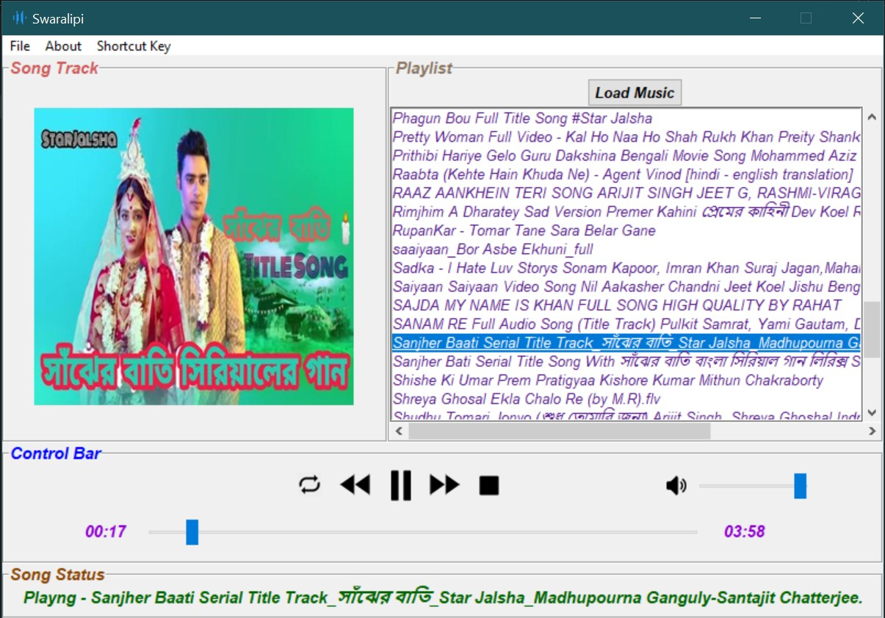

# ***Musicolet--Music-Player***
## About
This is a music player application named as ***Musicolet***. This have all the features required in a music player. It is made using python thinter.

## Features
| No | Name |
|----|------|
|1|Play/Pause|
|2|Next Track|
|3|Previous Track|
|4|Stop|
|5|Mute|
|6|Adjust Volume|
|7|Open Folder|
|8|Open File|
|9|Select Particular Track From The Playlist|
|10|Working Progress Bar|
|11|Current Duration of track and Total duration of track|
|12|Album Art|
|13|Label to describe the buttons|
|14|Userfriendly Interface|
|15|Menu for Shortcut Key|
|16|Many Shortcut key Present|

## Install the Dependencies

To use this beautiful Muiscplayer - Musicolet first you need to install python in your machine.
to install python in your machine you may checkout on this [page](https://realpython.com/installing-python/) or google it.

## How to Run

To run this this Musicplayer you need to install some python module.
To install all module you can install them mannually by
```
pip install module-name
```
in your cmd.  
i am listing all module name in requirements.txt   
or you can install all modules one command -   
first open your cmd in Musicolet Directory and then just simply run this command - 
```
pip install -r requirements.txt
```
Its automatically install all the python modules and you are ready to go..
Now you just open your cmd in Musicolet Directory and just run this command - 
```
python main.py
```
Now you can enjoy the Musicolet.

## Screenshot

